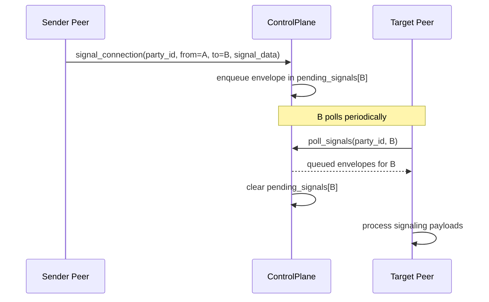

# Signal Queue/Poll Sequence

Queued signaling delivery flow used by control-plane peers.

Semantics:
- Queue is keyed by target peer ID.
- Poll returns all queued items for the target peer.
- Poll clears returned queue entries.

Related docs:
- [Control Plane](/docs/core/control_plane/CONTROL_PLANE.md)
- [Connection Management](/docs/core/networking/CONNECTION.md)
