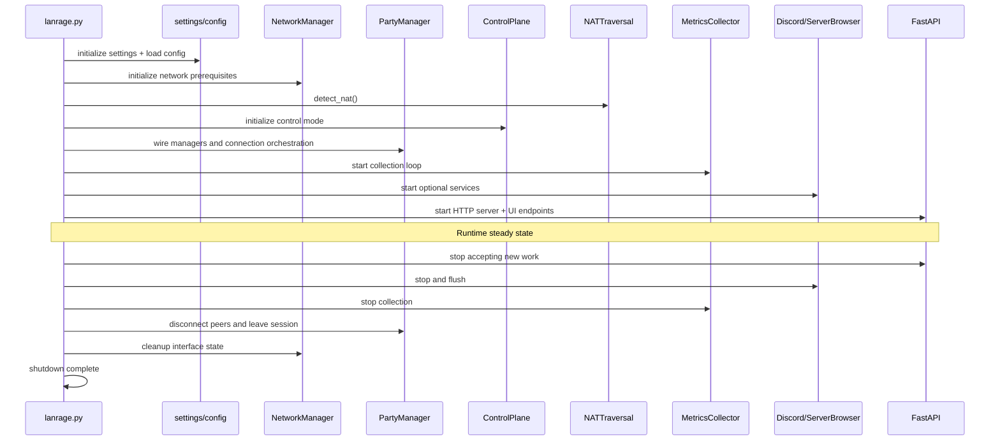

# Startup Sequence

This diagram captures the initialization and shutdown sequence used by `lanrage.py`.

Related docs:
- [Architecture](../ARCHITECTURE.md)
- [System Flow Overview](SYSTEM_FLOW.md)
- [Runtime Control Loops](RUNTIME_CONTROL_LOOPS.md)
