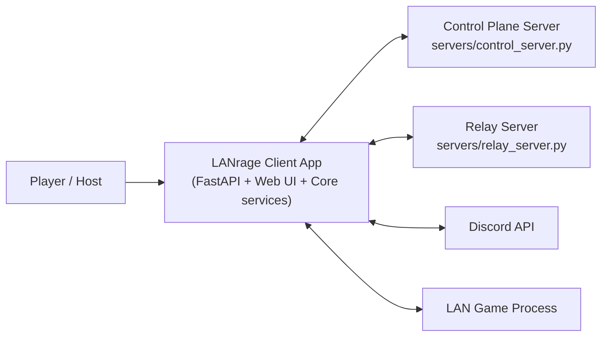

# System Context

```mermaid
flowchart LR
    USER["Player / Host"]
    CLIENT["LANrage Client App\n(FastAPI + Web UI + Core services)"]
    CONTROL["Control Plane Server\nservers/control_server.py"]
    RELAY["Relay Server\nservers/relay_server.py"]
    DISCORD["Discord API"]
    GAME["LAN Game Process"]

    USER --> CLIENT
    CLIENT <--> CONTROL
    CLIENT <--> RELAY
    CLIENT <--> DISCORD
    CLIENT <--> GAME
```
