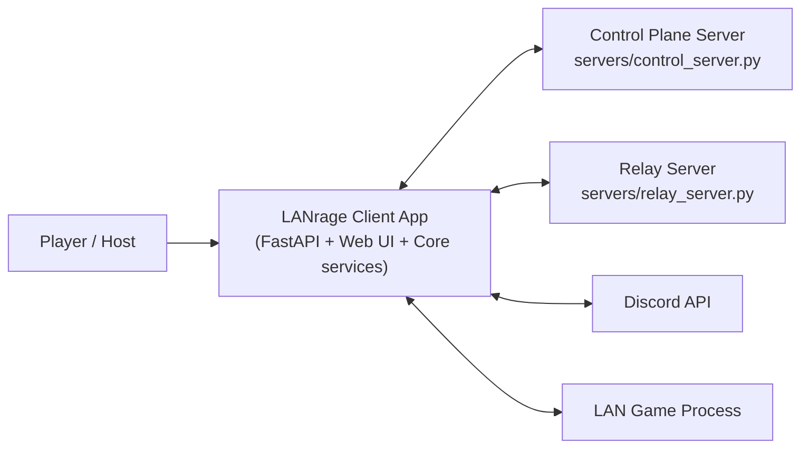
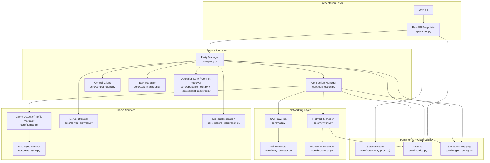
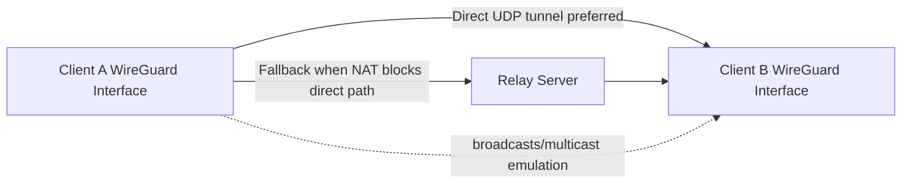
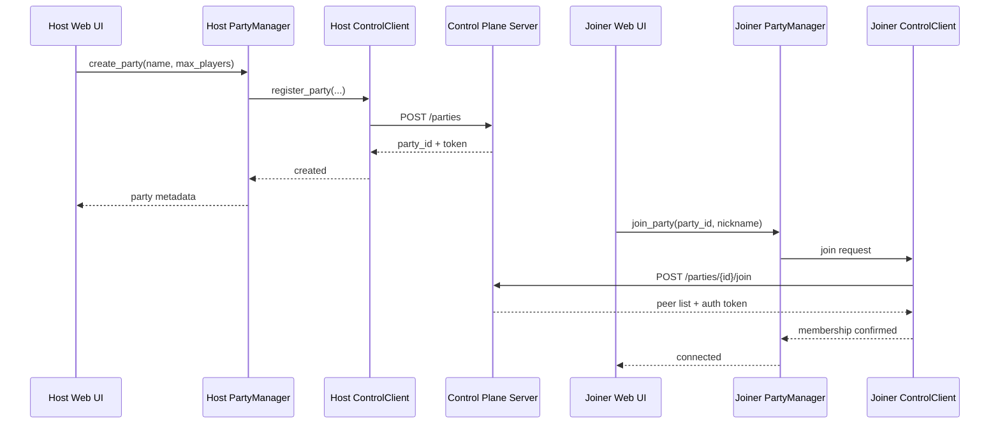
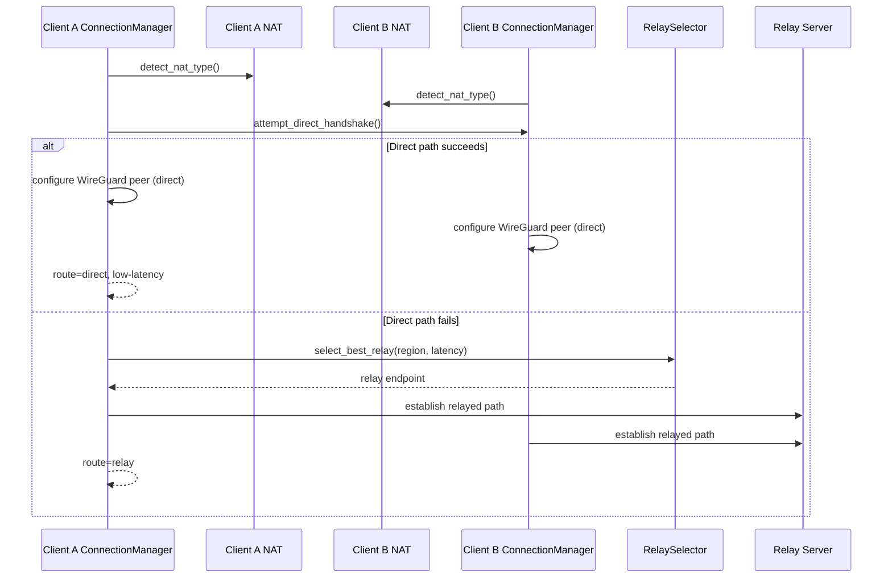
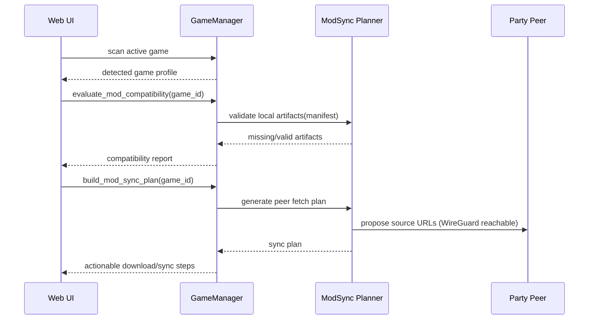
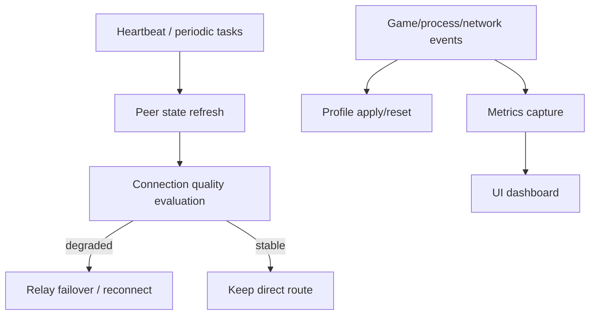
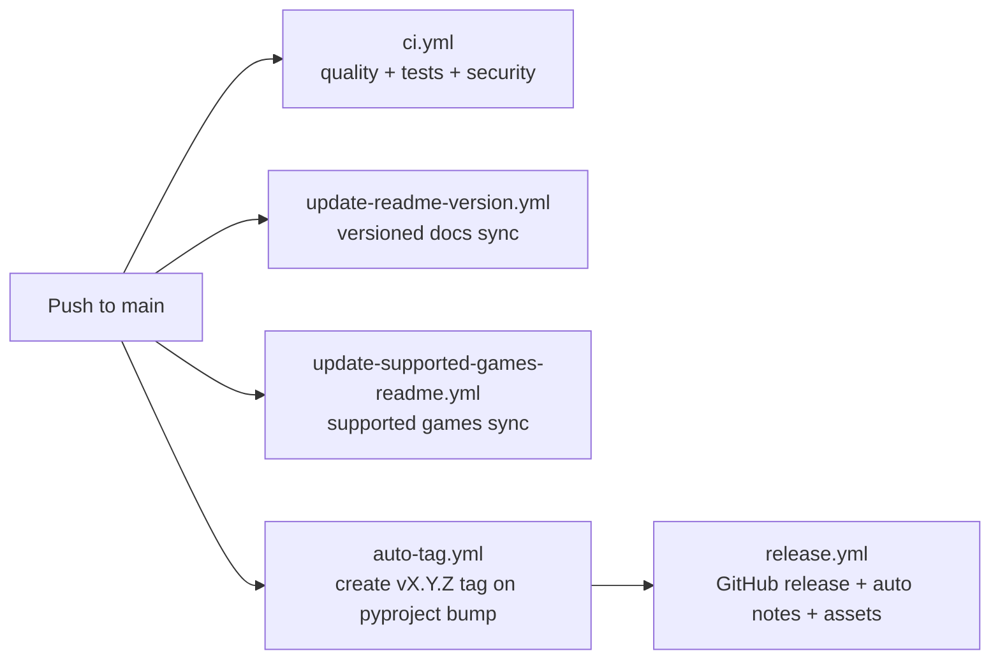

[Diagram Pack Index](README.md)

# LANrage System Flow Diagrams

This document is the detailed visual map of how LANrage works end-to-end.

## 1. System Context

## 2. Client Internal Components

## 3. End-to-End Data Plane Paths

## 4. Sequence: Party Create + Join

## 5. Sequence: Connection Establishment and Fallback

## 6. Sequence: Game Detection + Mod Sync Planning

## 7. Runtime Signals and Control Loops

## 8. CI/CD and Documentation Automation

## 9. Failure Domains and Fallback Strategy

- Control plane unavailable: existing tunnels can continue; new joins/deep discovery degrade.
- Direct P2P blocked by NAT/firewall: relay fallback path is used.
- Relay degraded: selector can re-rank and switch to next candidate.
- Game mod mismatch: compatibility report + sync planning gives deterministic remediation path.

## 10. Reading Order for New Contributors

1. `docs/ARCHITECTURE.md`
2. This file (`docs/diagrams/SYSTEM_FLOW.md`)
3. `docs/CONTROL_PLANE.md`
4. `docs/NAT_TRAVERSAL.md`
5. `docs/TESTING.md`

